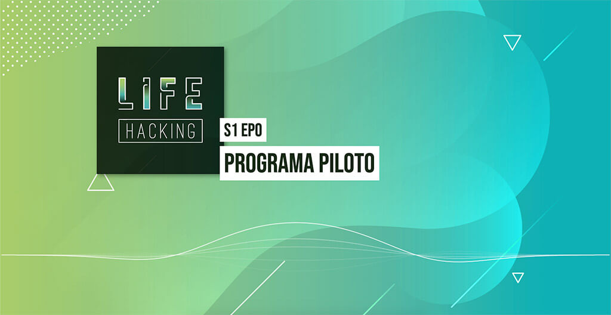

# Podcast to Social
Esse projeto nasceu depois de uma busca por ferramentas para divulgação de podcast.
Nessa busca, o mais perto que cheguei foi um template de After Effects, o que não me ajudou muito.

Procurando alternativas então, encontrei o [howler.js](https://howlerjs.com/) e foi no demo "Music Player" dele, encontrei tanto a solução para manusear o áudio, quanto a parte das ondas. Na verdade, é de lá que vem boa parte do código desse projeto. Claro, contando com a ajuda visual da excelente [@mandyellow](https://github.com/mandyellow).

A diferença que eu adicionei foi a opção de definir um começo e um tempo que o áudio vai ficar tocando, ideal para criar pequenos drops para ser compartilhado nos stories do Instagram, por exemplo. Para isso é só ativar o modo responsivo do seu navegador e mudar para uma visão de celular.

## Como usar
- Customize o estilo da página para se adequar ao seu projeto
- Adicione seu arquivo de áudio
- Adicione o path do seu arquivo de áudio e as infos do episodio no objeto de configuração do player
- Grave sua tela enquanto o áudio está tocando
- Agora é só compartilhar onde quiser. Youtube, Instagram, Facebook...

## Configuração do Player
O Player tem cinco configurações principais:

**epNumber**  
Número do episódio ou o que quiser colocar no retangulo superior

**title**  
Título do episódio ou o que quiser colocar no retangulo inferior

**file**  
O caminho do seu arquivo de audio partindo da raíz

**cutStart** (opcional)  
Em que segundo do audio começar a tocar

**cutLength** (opcional)  
Por quantos segundos tocar o áudio

## BETA: Automação de Produção
Ao acessar a página, apertar R vai solicitar autorização para gravar a tela e gerar um recorte de 5 segundos (configurável no `player.js`) como `loop-file.webm` no diretório de download padrão do navegador.
No `package.json`, configurar nome do arquivo de áudio e diretório do loop-file e rodar o comando `npm start`. Esse comando vai copiar o mp3 pra onde tem o `loop-file.webm`, vai rodar um conversor de webm para mp4 cortando os 3 primeiros segundos e criar um arquivo de vídeo com o loop do `loop-file` do tamanho do mp3 com o áudio ao fundo e, por fim, move o arquivo final de volta pra pasta do projeto.

PS - Ter o [FFmpeg](https://github.com/FFmpeg/FFmpeg) instalado é requisito para rodar os scripts acima.
